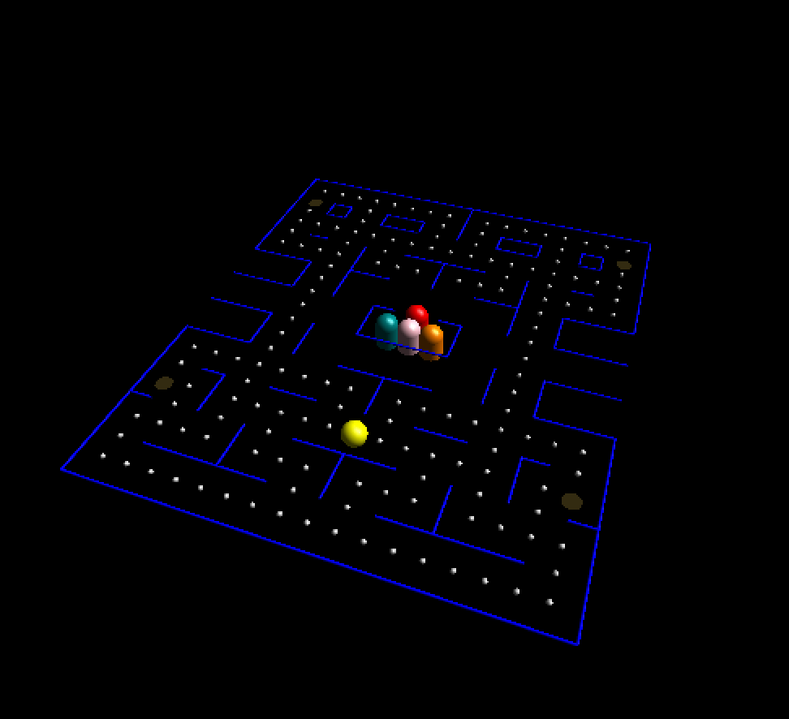

# 3D Pacman Map

A 3D rendering of the classic Pac-Man maze built with OpenGL and FreeGLUT in C++. The project recreates the iconic Pac-Man map in three dimensions, complete with Pac-Man, all four ghosts, coins, and power-ups.

## Preview



The scene is rendered from a top-down perspective with a 3D camera, showing:
- 🟡 **Pac-Man** — yellow sphere positioned at his starting location
- 👻 **4 Ghosts** — Blinky (red), Pinky (pink), Inky (teal), and Clyde (orange), each rendered with a sphere head and cylinder body
- ⚪ **Coins** — small silver spheres scattered throughout the maze
- 🟡 **Power-ups** — golden disks at the four corners
- 🔵 **Walls** — blue cylinders forming the maze structure

## Requirements

- C++ compiler (I use g++)
- OpenGL
- FreeGLUT
- GLU

## Installation

### macOS
```bash
brew install freeglut
```

### Linux (Ubuntu/Debian)
```bash
sudo apt install freeglut3-dev g++
```

### Windows
Download FreeGLUT from [freeglut.sourceforge.net](https://freeglut.sourceforge.net/) and link it with MinGW or Visual Studio.

## Build & Run

### macOS
```bash
g++ 3dPacmanMap.cpp -o 3dPacmanMap -framework OpenGL -framework GLUT -I/opt/homebrew/include
./3dPacmanMap
```

### Linux
```bash
g++ 3dPacmanMap.cpp -o 3dPacmanMap -lGL -lGLU -lglut
./3dPacmanMap
```

### Windows (MinGW)
```bash
g++ 3dPacmanMap.cpp -o 3dPacmanMap -lfreeglut -lopengl32 -lglu32
```

## Controls

| Key | Action |
|-----|--------|
| `R` | Rotate the maze 5° around the Y-axis |

## Map Legend

The maze is defined as a 22×19 integer grid:

| Value | Object |
|-------|--------|
| `0` | Empty space |
| `1` | Coin |
| `2` | Power-up |
| `3` | Ghost starting position |
| `4` | Pac-Man starting position |
| `5` | Wall |


## Built With

- [OpenGL](https://www.opengl.org/)
- [FreeGLUT](https://freeglut.sourceforge.net/)
